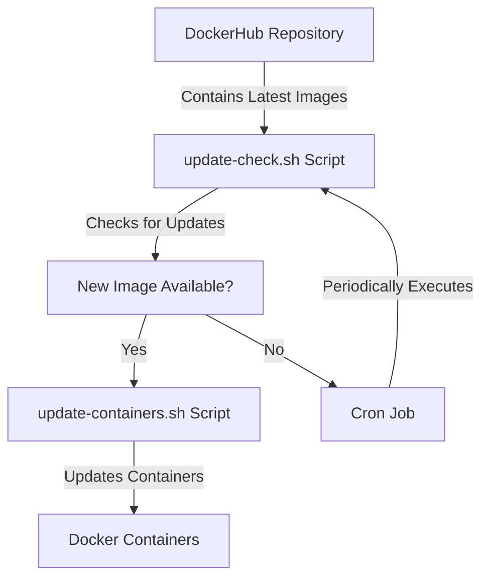

## Bonus 2 - [Zhu Li, Do the Thing!](https://www.youtube.com/watch?v=mofRHlO1E_A)
## Automated Docker Container Update Process

### Diagram

```mermaid
graph TD;
    DockerHub_Repo["DockerHub Repository"];
    Cron_Job["Cron Job"];
    Update_Check_Script["update-check.sh Script"];
    New_Image["New Image Available?"];
    Update_Containers_Script["update-containers.sh Script"];
    Docker_Containers["Docker Containers"];

    DockerHub_Repo -->|Contains Latest Images| Update_Check_Script;
    Cron_Job -->|Periodically Executes| Update_Check_Script;
    Update_Check_Script -->|Checks for Updates| New_Image;
    New_Image -->|Yes| Update_Containers_Script;
    New_Image -->|No| Cron_Job;
    Update_Containers_Script -->|Updates Containers| Docker_Containers;
```
#### Descreiption 

