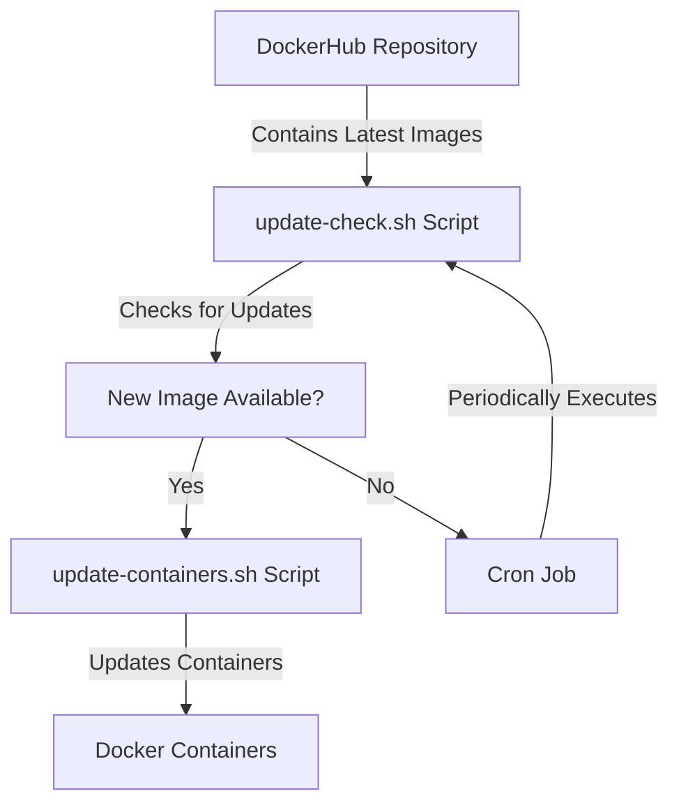

## Bonus 2 - [Zhu Li, Do the Thing!](https://www.youtube.com/watch?v=mofRHlO1E_A)
## Automated Docker Container Update Process

### Diagram

#### Description:

1. **DockerHub Repository:** The DockerHub repository contains the latest Docker images for your web application services.
2. **Cron Job:** A cron job is scheduled to run periodically on each host.
3. **update-check.sh Script:** The cron job executes the `update-check.sh` script, which checks the DockerHub repository for updates.
4. **New Image Available:** If a new image is available on DockerHub, the script pulls the latest image.
5. **update-containers.sh Script:** The script then updates the Docker containers using the `update-containers.sh` script.
6. **Docker Containers:** The Docker containers are restarted with the latest image.

### Documentation
#### Implementation Overview:

* The automation process involves using two bash scripts (`update-check.sh` and `update-containers.sh`) and a cron job to periodically check for updates in the DockerHub repository and update Docker containers accordingly.
* The `update-check.sh` script checks for updates in the DockerHub repository and pulls the latest image if available.
* If a new image is pulled, the script triggers the `update-containers.sh` script to update the Docker containers with the latest image.
* The cron job schedules the execution of the `update-check.sh` script at regular intervals, ensuring that the Docker containers are kept up-to-date.

#### Steps to Recreate: 

